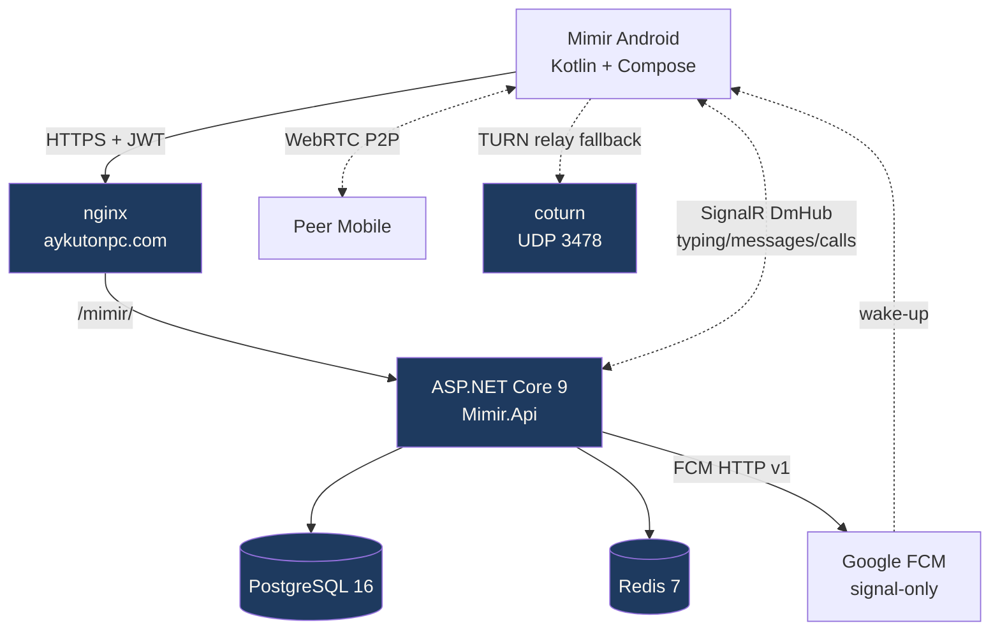

# Mimir — Backend

> **Mimir** is a self-hosted, invite-only personal messaging network — full backend in **ASP.NET Core 9** with PostgreSQL, Redis, SignalR, WebRTC signaling and FCM push.
> Named after the Norse keeper of the well of wisdom.

[](https://aykutonpc.com/mimir/health)
[](LICENSE)
[](https://github.com/Aykuttonpc/mimir-api/actions)

## ✨ Features

- 🔐 **Closed network** — invite token + admin approval, no public signup
- 💬 **Real-time DM** — SignalR push (typing, edit, soft-delete, read receipts)
- 🔒 **AES-256-GCM at-rest** message encryption (per-message random IV)
- 🔑 **JWT auth** — access + refresh token rotation with reuse detection
- 👥 **Friend-key gating** — users share short keys, no public discovery (ADR-016)
- 🟢 **Presence** — online/offline + last-seen, broadcast only to friends
- 🔔 **FCM push (signal-only)** — content stays on Mimir backend; only "wake up" signals go to Google
- 📞 **WebRTC voice call** — P2P + coturn TURN fallback, ephemeral (no DB record)
- 🚦 **App version gate** — backend-authoritative force update for old APKs
- 🛡️ **Rate limit** — IP-based fixed-window on auth + friend-request paths
- ✉️ **SMTP** email verification (iCloud SMTP relay, 30 min token TTL)
- 🚀 **CI/CD** — GitHub Actions: push → VPS rebuild + healthcheck + auto-rollback

## 🏗️ Architecture



## 🧰 Stack

| Layer | Tech |
|---|---|
| Runtime | .NET 9, ASP.NET Core, EF Core 9 |
| DB | PostgreSQL 16 (Npgsql) |
| Cache | Redis 7 |
| Real-time | SignalR (DmHub) |
| Push | Firebase Admin SDK 3.0 (signal-only) |
| Voice | WebRTC signaling + coturn 4.6 (HMAC short-lived TURN creds) |
| Auth | JWT HS256 (15min access + 30day refresh rotation) |
| Crypto | AES-256-GCM (BCL `AesGcm`) |
| Password | BCrypt.Net workFactor=12 |
| Email | MailKit 4.16 (SMTP) |
| Container | Docker Compose, immutable image tags (`commit SHA`) |
| Reverse proxy | nginx (Let's Encrypt) |
| Hosting | Hetzner Cloud CPX21 |

## 🚀 Quick Start

```bash
# 1. Clone + secrets
git clone https://github.com/Aykuttonpc/mimir-api.git
cd mimir-api
cp deployment/.env.prod.example deployment/.env.prod
# Fill secrets: DB_PASSWORD, REDIS_PASSWORD, JWT_KEY (32+ char), CRYPTO_MESSAGE_KEY (base64-encoded 32 byte), SMTP_*, etc.

# 2. FCM service account (Firebase Console → Project Settings → Service accounts → Generate)
mkdir -p secrets
# Put JSON at: secrets/fcm-service-account.json

# 3. Build + run
cd deployment
docker compose -f docker-compose.prod.yml --env-file .env.prod up -d --build

# 4. Healthcheck
curl https://your-domain/mimir/health
```

## 📚 Architecture Decisions

All decisions tracked as ADRs in [`.claudeteam/DECISIONS.md`](.claudeteam/DECISIONS.md). Highlights:

- **ADR-002** Firebase exit (auth/db/storage self-hosted, only FCM kept for push)
- **ADR-007** Path-prefix routing (single VPS for multi-project)
- **ADR-012** AES-256-GCM at-rest encryption
- **ADR-015** Backend-authoritative app version gate
- **ADR-016** Friend-key + approval friendship model
- **ADR-017** FCM signal-only push (Signal/WhatsApp pattern)
- **ADR-018** In-memory presence tracker
- **ADR-019** WebRTC call: GetStream baseline + adapter pattern

## 🛡️ Security Highlights

| Concern | Mitigation |
|---|---|
| User enumeration | Generic errors on register/login |
| Token theft | Refresh rotation + reuse detection (revokes all sessions) |
| IDOR | Per-endpoint sender/recipient guards + friendship gating |
| Brute force | Rate limit (auth-register: 5/min, auth-login: 10/min) |
| Session hijack | Password change revokes all refresh tokens |
| Insecure crypto | AES-GCM (auth tag), random IV per message |
| Secret leak | `.env.prod` + FCM JSON gitignored; RO volume mount in container |
| Replay (TURN) | HMAC time-limited (1 hour) credentials |
| Outdated client | Backend version gate returns HTTP 426 |

OWASP Top 10 audit summary: no critical findings (Sprint #13).

## 📱 Mobile Companion

Android client (Kotlin + Jetpack Compose): [mimir-mobile](https://github.com/Aykuttonpc/mimir-mobile)

## 📄 License

MIT — see [LICENSE](LICENSE).

## 🙏 Acknowledgments

- WebRTC PeerConnection + signaling patterns inspired by [GetStream/webrtc-in-jetpack-compose](https://github.com/GetStream/webrtc-in-jetpack-compose) (Apache 2.0).
